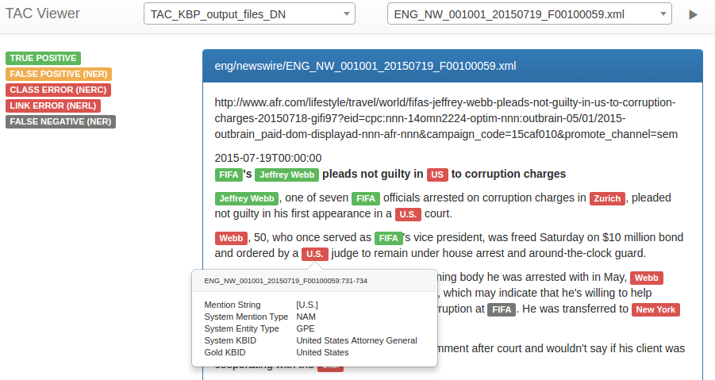

# elvis

Very lightweight annotation visualization for the EDL branch of TAC 2015/2016 with a browser 
UI. This project was only intended as a quick and small helper for error analysis and 
is not a full blown entity linking visualization tool. 

### Features

Select from multiple system outputs
Shows annotation errors for: 
 - strong mention match
 - strong typed mention match
 - strong linked mention match
 - select/deselect strong typed mention match and strong linked mention match (i.e. CLASS ERROR and LINK ERROR)
 
 
 
### Usage

Start by completing the configuration in elvis/config.py (follow the explanations in the config).

Start the server with

```
$ ./main.py
```

Which will produce the message (if you didn't change the host and port in config)

```
 * Running on http://127.0.0.1:33507/ (Press CTRL+C to quit)
```

Point your browser to http://127.0.0.1:33507/ to use elvis.

### Requirements

Only tested on Linux. Requires Python3, pandas and flask.

### Issues

To resolve the KBIDs to something human readable implement the function get_entity_name_from_id(entity_id) in utils.py.

Known issues that I probably won't fix:

 - Does not handle overlapping but not embedding mention spans correctly. 
 - Clicking on mentions with embedded mentions leads to multiple conflicting popups. 
